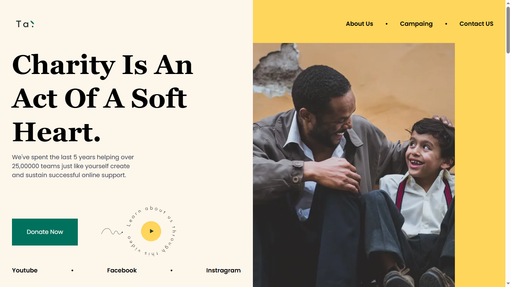

# 🚀 Clone Landing Page  

  

## 📖 Descripción  
Este proyecto es un **clone de una landing page**, desarrollado como trabajo final del curso de **Programación Fullstack en la UTN**.  

La aplicación fue construida con:  
- ⚛️ **React**  
- 🎨 **Tailwind CSS**  
- ⚡ **Vite** 

El objetivo principal fue aplicar en un proyecto real los conceptos aprendidos a lo largo del curso, trabajando sobre el diseño, la maquetación y el responsive.  

## 🔗 Deploy  
👉 [Ver proyecto online](https://clone-landing-page-psi.vercel.app/)  

